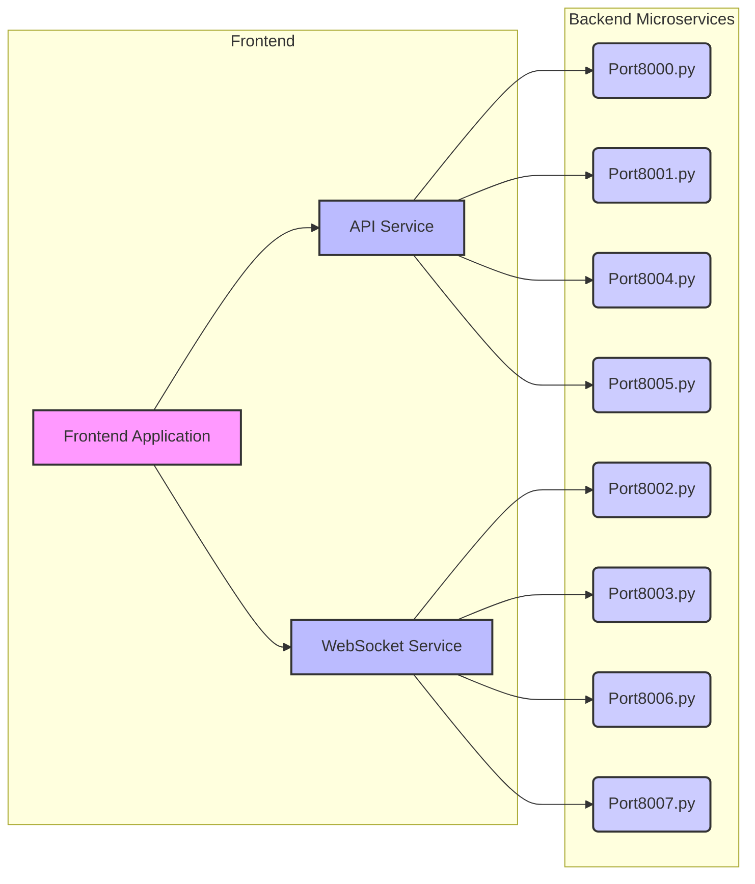

# Trading Platform v11

## Project Description
This project is a comprehensive trading platform, version 11, designed to provide real-time data visualization, analysis, and potentially trading functionalities. It is built with a microservices architecture for the backend, primarily in Python, and a JavaScript-based frontend for an interactive user experience.

## Features
-   **Real-time Data Visualization:** Display of financial data, likely in chart format.
-   **Microservices Architecture:** Backend functionalities are modularized into independent services.
-   **Logging System:** Robust logging with file and console handlers, including JSON formatting for structured logs.
-   **Virtual Environment:** Isolated Python environment for dependencies.
-   **Monitoring Tools:** Scripts for data availability checks and diagnostics.

## Technologies Used

### Frontend
-   **JavaScript:** Core language for the web application.
-   **HTML5/CSS3:** For structuring and styling the user interface.
-   **Chart.js (Inferred):** Given the `chart-drawing.js` and `_chart.css`, it's highly probable a charting library like Chart.js or similar is used.
-   **Bootstrap/Material Design (Inferred):** Based on the presence of `_utilities.css` and general web development practices, a UI framework might be in use.

### Backend (Microservices)
-   **Python:** Primary language for all microservices.
-   **FastAPI (Inferred):** Given the `uvicorn` loggers in `logging_config.py`, FastAPI is likely used for building the APIs.
-   **Uvicorn:** ASGI server for running the FastAPI applications.
-   **`python-json-logger`:** For JSON formatted logs.
-   **`colorlog`:** For colored console output in logs.

### Development Tools
-   **Git:** Version control.
-   **Python Virtual Environment (`venv`):** For managing Python dependencies.

## Prerequisites
Before you begin, ensure you have the following installed:
-   **Git:** [https://git-scm.com/](https://git-scm.com/)
-   **Python 3.8+:** [https://www.python.org/downloads/](https://www.python.org/downloads/)
-   **Node.js & npm (or Yarn):** [https://nodejs.org/](https://nodejs.org/) (for frontend development)

## Setup Instructions

1.  **Clone the repository:**
    ```bash
    git clone https://github.com/your-username/trading_platform_v11.git
    cd trading_platform_v11
    ```

2.  **Set up the Python Virtual Environment:**
    ```bash
    python -m venv .venv
    ```
    On Windows:
    ```bash
    .venv\Scripts\activate
    ```
    On macOS/Linux:
    ```bash
    source .venv/bin/activate
    ```

3.  **Install Python Dependencies:**
    (Assuming a `requirements.txt` exists or will be created. If not, you'll need to install them manually based on the microservices.)
    ```bash
    pip install -r requirements.txt
    ```
    *Note: If `requirements.txt` is not present, you will need to install `fastapi`, `uvicorn`, `python-json-logger`, `colorlog`, and any other dependencies your microservices use.*

4.  **Install Frontend Dependencies:**
    Navigate to the `frontend` directory and install Node.js packages.
    ```bash
    cd frontend
    npm install # or yarn install
    cd ..
    ```

## Running the Application

### 1. Start the Backend Microservices
On Windows, use the provided batch script:
```bash
run_microservices.bat
```
This script will activate the virtual environment and start all Python microservices (Port8000.py to Port8007.py) in the background.

### 2. Start the Frontend Development Server
Navigate to the `frontend` directory and start the development server:
```bash
cd frontend
npm start # or yarn start
```
This will typically open the application in your default web browser at `http://localhost:3000` (or another port, as indicated by the terminal output).

## Architecture Diagrams

### Microservices Interaction



### Project Directory Structure

```mermaid
graph TD
    A[trading_platform_v11] --> B[.git/]
    A --> C[.venv/]
    A --> D[frontend/]
    D --> D1[dist/]
    D --> D2[public/]
    D --> D3[src/]
    D3 --> D3a[components/]
    D3 --> D3b[pages/]
    D3 --> D3c[services/]
    D3 --> D3d[utils/]
    A --> E[Microservices/]
    E --> E1[logging_config.py]
    E --> E2[Port8000.py]
    E --> E3[Port8001.py]
    E --> E4[Port8002.py]
    E --> E5[Port8003.py]
    E --> E6[Port8004.py]
    E --> E7[Port8005.py]
    E --> E8[Port8006.py]
    E --> E9[Port8007.py]
    A --> F[monitor/]
    F --> F1[check_data_availability.py]
    F --> F2[diagnose_bad_candle.py]
    A --> G[run_microservices.bat]
    A --> H[README.md]
    A --> I[.gitignore]

    style A fill:#ADD8E6,stroke:#333,stroke-width:2px
    style B fill:#FFD700,stroke:#333,stroke-width:2px
    style C fill:#FFD700,stroke:#333,stroke-width:2px
    style D fill:#90EE90,stroke:#333,stroke-width:2px
    style D1 fill:#D3D3D3,stroke:#333,stroke-width:1px
    style D2 fill:#D3D3D3,stroke:#333,stroke-width:1px
    style D3 fill:#D3D3D3,stroke:#333,stroke-width:1px
    style D3a fill:#E0FFFF,stroke:#333,stroke-width:1px
    style D3b fill:#E0FFFF,stroke:#333,stroke-width:1px
    style D3c fill:#E0FFFF,stroke:#333,stroke-width:1px
    style D3d fill:#E0FFFF,stroke:#333,stroke-width:1px
    style E fill:#FFB6C1,stroke:#333,stroke-width:2px
    style E1 fill:#D3D3D3,stroke:#333,stroke-width:1px
    style E2 fill:#D3D3D3,stroke:#333,stroke-width:1px
    style E3 fill:#D3D3D3,stroke:#333,stroke-width:1px
    style E4 fill:#D3D3D3,stroke:#333,stroke-width:1px
    style E5 fill:#D3D3D3,stroke:#333,stroke-width:1px
    style E6 fill:#D3D3D3,stroke:#333,stroke-width:1px
    style E7 fill:#D3D3D3,stroke:#333,stroke-width:1px
    style E8 fill:#D3D3D3,stroke:#333,stroke-width:1px
    style E9 fill:#D3D3D3,stroke:#333,stroke-width:1px
    style F fill:#ADD8E6,stroke:#333,stroke-width:2px
    style F1 fill:#D3D3D3,stroke:#333,stroke-width:1px
    style F2 fill:#D3D3D3,stroke:#333,stroke-width:1px
    style G fill:#D3D3D3,stroke:#333,stroke-width:1px
    style H fill:#D3D3D3,stroke:#333,stroke-width:1px
    style I fill:#D3D3D3,stroke:#333,stroke-width:1px
```



## Project Structure
(The detailed text-based structure is now replaced by the Mermaid diagram above.)


## Logging
The project uses a centralized logging configuration defined in `Microservices/logging_config.py`. It provides:
-   **Console Output:** Colored logs for `INFO`, `WARNING`, `ERROR`, `CRITICAL` levels (configurable to `WARNING` and above).
-   **File Output:** JSON formatted logs for `DEBUG`, `INFO`, `WARNING`, `ERROR` levels, rotated daily and stored in `logs/<service_name>/<date>/`.
-   **Uvicorn Logging:** Separate handling for Uvicorn access and error logs.

## Contributing
Contributions are welcome! Please follow these steps:
1.  Fork the repository.
2.  Create a new branch (`git checkout -b feature/your-feature-name`).
3.  Make your changes.
4.  Commit your changes (`git commit -m 'Add new feature'`).
5.  Push to the branch (`git push origin feature/your-feature-name`).
6.  Open a Pull Request.

## License
This project is licensed under the MIT License - see the LICENSE.md file for details (if applicable).
